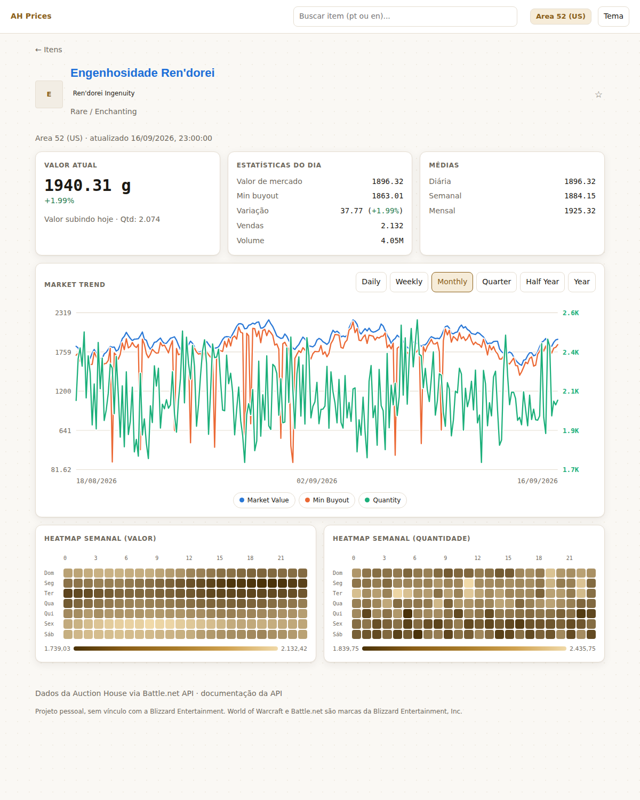
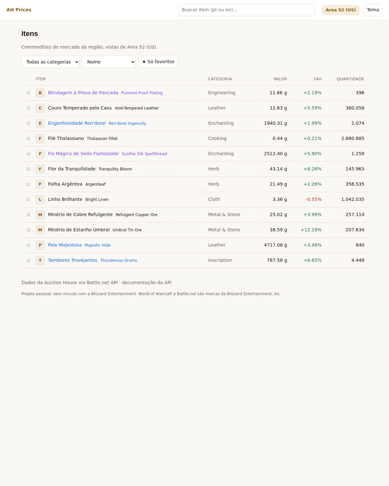

# WoW AH Prices

Preços e histórico das commodities da Auction House do World of Warcraft.
Ingere os leilões pela Battle.net API de hora em hora, acumula a série que a
Blizzard não guarda e serve catálogo, gráfico e heatmap semanal.



## Por que existe

A API da Blizzard devolve **só a foto atual** da Auction House — não existe
endpoint de histórico. Quem quiser saber se um minério está caro hoje precisa ter
guardado o preço de ontem. Este projeto guarda.

## O realm

O app está fixado em **Area 52 (US)**. Uma ressalva que vale antes de olhar os
números: o endpoint de commodities da Blizzard é **regional**, não por realm —
o preço aqui é o mesmo para qualquer realm dos Estados Unidos. "Area 52" é o
realm de quem usa; os números valem para ele, sem serem exclusivos dele. O
detalhe está em [`docs/arquitetura.md`](docs/arquitetura.md#o-realm-fixado).

## O que faz

- **Busca com ícone** do item, em português ou em inglês: o dropdown mostra a
  arte antes do nome, que é como se reconhece um item do jogo.
- **Catálogo** com filtro por categoria e ordenação por valor, alta ou
  quantidade.
- **Favoritos** marcados na estrela, com filtro para ver só eles.
- **Página do item** com valor atual, variação de 24h, vendas e volume, além das
  médias diária, semanal e mensal comparando US e EU.
- **Gráfico** com três séries — market value, min buyout e quantity — que se
  ligam e desligam na legenda, em seis faixas de um dia a um ano.
- **Heatmap semanal** de valor e de quantidade (7x24): mostra o padrão de reset,
  de noite de raide e de fim de semana.
- **Nomes em português** vindos do `locale=pt_BR` da API, com o nome em inglês
  ao lado — que é o que aparece na Auction House e o que se digita para buscar.
- **API REST** documentada em `/docs` (OpenAPI gerado pelo FastAPI).



## Rodar em um minuto

Não precisa de credencial da Blizzard: o seed gera um ano de dados fictícios.

```bash
python -m venv .venv && source .venv/bin/activate   # Windows: .venv\Scripts\activate
make instalar
make seed
make servir
```

Abre em <http://localhost:8000>. A documentação da API fica em
<http://localhost:8000/docs>.

Com Docker:

```bash
docker compose up -d api
docker compose run --rm semente
```

## Dados de verdade

Crie um cliente em <https://develop.battle.net/access/clients> (gratuito),
copie `.env.example` para `.env` e preencha:

```env
BLIZZARD_CLIENT_ID=...
BLIZZARD_CLIENT_SECRET=...
```

```bash
make ingerir     # uma execução: grava o snapshot da hora atual
```

Para acumular histórico, agende de hora em hora:

```cron
# Linux e macOS — crontab -e
0 * * * * cd /caminho/do/projeto && .venv/bin/python -m backend.app.ingestao
```

No Windows, Task Scheduler com gatilho diário repetindo a cada 1 hora e a ação
`python -m backend.app.ingestao` na pasta do projeto.

## Arquitetura

```
Battle.net API → ingestao.py → SQLite → estatisticas.py → API REST → Frontend
                 (1x/hora)     (1 linha por item/região/hora)
```

A chave primária `(item_id, region, ts)` é a peça central: ela faz a ingestão ser
idempotente, e rodar duas vezes a mesma hora sobrescreve em vez de duplicar.

Detalhes em [`docs/arquitetura.md`](docs/arquitetura.md). As decisões estão em
ADRs, cada uma com o que foi descartado e por quê:

| ADR | Decisão |
|---|---|
| [0001](docs/adr/0001-sqlite-sem-orm.md) | SQLite com o módulo `sqlite3`, sem ORM |
| [0002](docs/adr/0002-frontend-sem-build.md) | Frontend sem bundler, gráfico em SVG |
| [0003](docs/adr/0003-valor-de-mercado.md) | Valor de mercado pela fatia mais barata |
| [0004](docs/adr/0004-ingestao-como-job.md) | Ingestão como job externo, sem worker |
| [0005](docs/adr/0005-eixo-duplo-e-series-alternaveis.md) | Eixo duplo no gráfico, com a ressalva registrada |

## Stack

**Backend** — Python 3.11+, FastAPI, SQLite pelo `sqlite3` da biblioteca padrão,
httpx.
**Frontend** — módulos ES nativos, SVG e CSS grid. Sem build, sem dependência de
runtime.
**Qualidade** — pytest, ruff, mypy, Playwright para o ponta a ponta.

A escolha que mais define o projeto é o que **não** entrou: sem ORM, sem
bundler, sem biblioteca de gráfico, sem broker de fila. Cada ausência tem um ADR
explicando em que ponto ela deixaria de fazer sentido.

## Desenvolvimento

```bash
make checar      # lint + tipos + suíte, o mesmo que o CI roda
make teste       # só a suíte
make cobertura   # suíte com relatório de cobertura
make e2e         # sobe o servidor e abre as telas num Chromium
make help        # lista os alvos
```

### Testes

86 testes em quatro frentes:

- `tests/estatisticas.test.py` — as agregações, incluindo os casos de banco
  vazio e a recusa de campo arbitrário no heatmap.
- `tests/api.test.py` — contrato HTTP, validação de parâmetro e códigos de erro.
- `tests/blizzard.test.py` — o cliente da Blizzard com `httpx.MockTransport`:
  roda offline e sem credencial.
- `tests/ingestao.test.py` — alinhamento de hora, idempotência, cálculo de
  vendas e o preenchimento de nomes e ícones.
- `scripts/ponta-a-ponta.mjs` — sobe o servidor, abre as duas telas num Chromium
  e confere que o que a API devolveu virou pixel.

O ponta a ponta existe porque o pytest para na fronteira do HTTP: ele prova que
`/api/items` devolve doze itens, não que a tabela desenhou doze linhas. Os dois
primeiros bugs que esse arquivo pegou foram exatamente desse tipo.

### CI/CD

`ci.yml`, em todo push e PR — lint, formatação, tipos e suíte com cobertura em
Python 3.11 e 3.13; checagem do frontend; e o ponta a ponta com Chromium, que só
roda depois que as duas metades passam.

`release.yml`, em tag `v*` — confere que a tag combina com a versão do
`pyproject.toml`, roda a suíte, publica a imagem no GitHub Container Registry e
abre o Release com o trecho do changelog.

## Licença

[MIT](LICENSE).

Projeto pessoal, sem vínculo com a Blizzard Entertainment. World of Warcraft e
Battle.net são marcas da Blizzard Entertainment, Inc.
